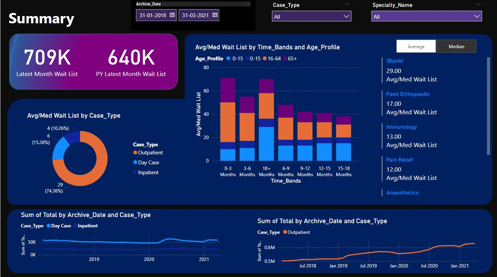
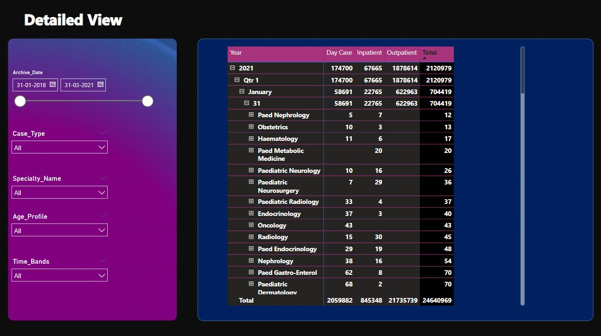

# Airport-Data-analysis
· Table Au, Python Data Analysis This research uses Tableau, a powerful data visualization tool, to explore and gain insights from airport data. The goal is to better understand airport operations, identify trends, and fnd ways to improve efciency and make the passenger experience smoother.
# 🛫 Airport Data Analysis using Tableau

This project leverages **Tableau**, a leading data visualization tool, to explore and derive insights from airport operations data. The primary goal is to uncover key trends, improve operational efficiency, and enhance the passenger experience through data-driven decision-making.

## 📌 Project Highlights
- Built an interactive dashboard with filters, slicers, and visuals using **Tableau Public / Tableau Desktop**
- Analyzed airport traffic, passenger flow, wait times, and peak congestion hours
- Identified trends that can support strategic improvements in airport logistics and passenger services
- Integrated **Python** for data cleaning and preprocessing prior to visualization

## 🚀 Tools & Technologies
- Tableau (Data Visualization)
- Python (Data Cleaning & Transformation)
- Pandas, NumPy
- CSV/Excel data sources

## 📊 Key Features of the Dashboard
- 📅 **Time-based Analysis**: Flights, delays, and passenger volume over time
- 📍 **Location-based Views**: Airport-level statistics and heatmaps
- 🧑‍🤝‍🧑 **Passenger Metrics**: Age groups, check-in behavior, wait times
- 📈 **Operational KPIs**: On-time performance, cancellations, and turnaround time

## 📷 Dashboard Preview

*Summary dashboard showing passenger trends, wait list analysis, and time-band-wise distribution.*

*Detailed view with drill-down by specialty, age profile, and case type filters.*

## 💡 Insights Delivered
- Identified peak travel hours and under-utilized time slots
- Revealed bottlenecks in check-in and security processes
- Highlighted month-on-month trends in passenger traffic and airport efficiency

## 🧠 Learning Outcomes
- Developed strong data storytelling using Tableau visuals
- Mastered dashboard design principles and visual best practices
- Gained practical experience in using filters, calculated fields, and dashboard actions

## 📁 How to View the Dashboard
> The `.twbx` or `.twb` Tableau file is available in the repository (or linked below).  
> You can also view the published version on **Tableau Public**:

[🔗 View Live Dashboard](#) <!-- Add your Tableau Public link here -->

## 👤 Author
- **Adithya B Chandran**

## 📄 License
This project is for academic and portfolio purposes only.

---

> 📈 Data Visualization Portfolio Project | Tool: Tableau | Domain: Airport Operations
